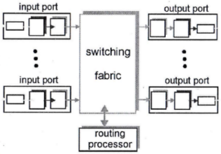

# Computer Networks Assignments
#### Reference material 
- Computer Networking: A Top Down Approach Featuring the Internet, Third Edition, J. Kurose and Keith Ross, Addison-Wesley, 2004
- Computer Networks - A Systems Approach, Fourth Edition, by Larry L. Peterson and Bruce S. Davie, Morgan Kaufmann, 2003
- Computer Networks, Fourth Edition, by Andrew S. Tanenabum, Printice Hall, 2003

## Assignment 1
### Problem 1
#### a) What are the types of computing devices?
<!-- this is Eng. Ahmad's answer-->
Computing devices are separated into desktop computers, mobile devices such as phones and laptops, IoT devices, data centers and supercomputers.

#### b) What is the difference between a distributed system and a network? How are they related?
   - A network is a collection of computer nodes connected together.
   - A distributed system is a collection of computing nodes that's interconnected and appears to the user as a single monolithic system.
   - They're related in the sense that every distributed system is a network with special abstracting software on it.

#### c) Describe transmission type in networks.
<table border="0"><tr><td>

- Broadcast:
   - single channel, shared by all nodes
   - data is sent as packets
   - supports single recipient, multicast and broadcast
   - intended recipients are indicated in the packet's address field
</td><td>


</td></tr><td>

- Point-to-point:
   - connection between individual node pairs
   - a packet might go through intermediate nodes before reaching destination
   - there could be multiple routes for a single packet
</td><td>


</td></tr></table>

#### d) What is the purpose of protocols, and what are the general functions they perform?
Protocols ensure successful communication by defining the format and the order of messages, as well as the actions taken on message transmission or receipt.

#### e) What si the difference between circuit switching and packet switching?
- Circuit switching:
   - dedicated lines between nodes
   - data is sent as a continuous stream
   - data is sent at a constant rate
- Packet switching:
   - different nodes use the same lines
   - data is transferred in small messages called packets
   - data is sent at a variable rate

Packet switching allows for more efficient use of communication lines.

### Problem 2
#### a) Describe the layering architecture used to build networks; what is its advantage?
Layered network models separate the process of of communication into a set of small discrete tasks, each assigned to a particular layer that works to perform that task only where:
- each layer performs a single well-defined function
- each layer provides the services of its function to the next layer in the hierarchy
- the chosen layer boundaries result in minimal information flow between layers
- the number of layers is large enough to avoid assigning separate functionalities to one layer, and small enough that minimal message passing occurs so the architecture stays simple and easy to manage.

The layered architecture is an abstraction of the network that helps us understand the network and its components, making it easier to understand the network, manage it and make changes to it.

### b) Explain the relationship and communication between (1.) layers at the same node. (2.) layers at two different nodes.
1. layers at the same node communicate through interfaces.
1. layers at different nodes communicate through protocols.

#### c) What are the main functions of the physical layer?
It transmits raw bits over the communication channel, manages connection initiation and termination, and defines the electrical specifications of the physical medium.

#### d) Suppose that node A wants to send data to node B. Outline how encapsulation is done as the data is moved between different layers at nodes A and B
```
[A]                        [B]
---------------------      --------------------
|  Application  🡫   |     |   🡫  Application  |        
---------------------      --------------------
|  Transport    🡫 🡩 |     | 🡩 🡫  Transport    |      
---------------------      --------------------
|  Network      🡫 🡩 |     | 🡩 🡫  Network      |    
---------------------      --------------------
|  Link         🡫 🡩 |     | 🡩 🡫  Link         | 
---------------------      --------------------
|  Physical       🡩 |<--->| 🡩    Physical     |       
---------------------      --------------------
```

### Problem 3
#### a) Where is the data link layer implemented?
In the network interface card (NIC).

#### b) Draw a block diagram to show the relationship of a network adapter to other host components and the protocol stack functionality.


#### c) (1.) Why is flow control needed in the DLL? (2.) Describe two types of control flow.
1. It's needed to avoid overwhelming one of the communicating nodes with data, especially if they're operating at different speeds.
1. - Feedback based: the receiver sends back info that lets the transmitter send more or less data.
   - Rate based: a built-in mechanism at the transmitter limits its transmission rate.

#### d) What is the difference between error detection and error correction? Explain when each strategy should be used.
- Error detection: mechanisms for a receiver node to detect errors.
- Error correction: mechanisms for a receiver node to detect errors and determine their locations so they can be corrected.

### ~~Problem 4~~
### ~~Problem 5~~

## Assignment 2
### ~~Problem 1~~
### ~~Problem 2~~
### ~~Problem 3~~
### Problem 4
#### a) What are the advantages and disadvantages of: (1.) polling protocols (2.) token protocols?
1. Polling protocols:
   - advantages:
      - simple
      - has no chance of collisions
      - easy to implement
   - disadvantages:
      - inefficient and slow
      - requires a central controller which is a single point of failure
2. Token passing protocols:
   - advantages:
      - faster than polling
      - decentralized and more robust than polling
      - results in lower latency
   - disadvantages:
      - has a single point of failure, where if the node holding the token fails, the whole ring fails.
  
#### b) (1.) Explain the Slotted-Aloha protocol. (2.) If there are 4 nodes willing to transmit their frames, draw a sketch that illustrates the disadvantages of Slotted-Aloha.
1. It's a data link layer protocol for frame transmission where:
   - frames are split into slots smaller than teh frame size
   - all the nodes attempt to transmit data at the beginning of a slot
   - if a collision is detected, all the colliding nodes wait a random period of time then attempt to transmit again
1. The notation C, E and S represent a collision, an empty slot and a successful transmission, respectively.
   

### ~~Problem 5~~

## Assignment 3
### Problem 1
#### a) Describe the connection and operation of a switch.
Switches are high performance multi-interface bridges.
   - They are layer 2 devices that connect multiple LANs/network segments with different technologies together.
   - Each LAN segment on a switch port is a separate collision domain.
   - There's no limit on how big a network segment can be.
   - Many switches operate in full-duplex mode, sending and receiving data at the same time.

#### b) What is the difference between a LAN and a subnet?
LANs are physical IP networks separated by routers, while subnets are logical IP networks separated in software ans can either be a superset of multiple LANs or a subset of on LAN.

#### c) What is the LAN (MAC) address?
They're 6 byte _data link layer_ addresses that are unique and permanent to each interface on a NIC, and are used as to identify devices in a network in order to allow routing in local network segments. They are managed and allocated by IEEE and are burned into the ROMs of each NIC.

#### d) What's the function of the ARP protocol?
It's a protocol that translates between IP Addresses and MAC Addresses on local networks.

#### e) What is the ARP table? And what entries does it have?
It's a table that maps IP addresses to MAC addresses, and is stored in the ARP module of every node in a LAN. 
It contains entries for:
   - IP addresses of each node in the LAN
   - MAC addresses of each node in the LAN
   - Time To Live (TTL) for each entry

### Problem 2
#### a) WHat is the advantage of adding collision detection to CSMA?
It helps efficiency and performance by aborting the transmission of corrupted, useless frames.

#### b) The Ethernet frame starts by an 8-byte preamble: (1.) What is the function of this preamble? (2.) Is the preamble included in the calculation of the frame's CRC? Why or why not?
1. It's used:
   - for clock synchronization between the transmitter and the receiver.
   - as a wake up call to the receiver
2. It's not included in the CRC calculation because it's redundant data, that's not part of the frame's payload and contains no useful information.

#### c) Suppose you want to connect 95 nodes 10Base2 Ethernet. How many repeaters do you need? and why?
Four repeaters, because the max number of nodes supported on each bus is 30, and ceil(95/30) = 3

#### d) Describe the Ethernet service type.
It's a connectionless service that provides best effort delivery of frames, and doesn't guarantee delivery or order of delivery.
   - No ACKs or NACKs are passed by senders or receivers.
   - The receiver just discards frames with failed CRC checks.
   - It's blind to the data it transmits:
      - It doesn't detect gaps in the data
      - Or recognize retransmissions
#### e) (1.) Why does Ethernet use Manchester encoding? (2.) If the bit stream is [11000110], draw a sketch to show how this stream is encoded.
1. It ensures that sender and receiver clocks stay in sync.
1. Baseband: 

Manchester encoding:

### Problem 3
#### a) What is the difference between an infrastructure network and an ad-hoc network?
- Infrastructure networks are 802.11 networks where all devices connect to each other (and maybe the internet) through a single access point
- Ad-hoc networks are a group of 802.11 stations that group themselves together to form a network  with no central control or connections to other networks.

<table border="0"><tr><td>

#### b) Explain how the 802.11 media access protocol can reserve access to a channel, and draw a schematic diagram to show the steps used to transmit data.
It uses RTS and CTS frames where the RTS frame is sent to the receiver and is heard by all devices in its vicinity, and if no collisions or fading occur to it, access to the receive is reserved and it sends back a CTS frame.

#### c) In 802.11 MAP, explain (1.) when DIFS and SIFS are used. (2.) Which one is longer and why?
1. DIFS is used before the very first transmission. SIFS is used after initiation, in connections subsequent to the first.
1. DIFS is longer because:
   - it's used to sense the readiness of a completely opaque station
   - to give higher priority to previously established connections over new attempts.

#### d) Explain how the hidden station problem can be avoided.
RTS frames are sent to be detected in the receivers vicinity, if a hidden station exists collisions will occur with this RTS frame, so no CTS frames will be sent back and no connection will be established.
</td><td>


</td></tr></table>

### Problem 4
#### a) What are the limitations of using hubs to connect nodes?
- all network segments must use the same ethernet technology
- independent collision domains are combined into one
- total number of hosts and tiers is limited

#### b) What are the types of switches? What is the strategy used to transmit frames by each type?
- Store and Forward: all frames are stored in a buffer until they are completely received, then they are transmitted. If the output buffer is empty but a frame wasn't fully received, a delay is generated by the switch.
- Cut-through switching: frames are transmitted as they come; If the output buffer is empty the switch transmits the start of the frame before receivin its end.
  
#### c) What is the maximum store and forward delay for a switch if the frame length is 900 bytes, the transmission rate of the inbound link is 24\*10^5 bit/sec, and teh transmission rate of outbound link is 36\*10^5 bit/sec?
max delay = (900\*8 bits) / (24\*10^5 bits/sec) = 0.003 sec

### Problem 5
#### ~~a) Assign MAC addresses to the nodes and routers~~
#### ~~b) Give the ARP table for node D, assuming it has recently communicated with all other nodes.~~
#### c) Explain the steps taken when A sends E a frame.
- A send the frame to interface 1 of the router R1
- the router R1 reads the frame's destination IP and checks whether its directly connected to it or not
- R1 finds that the destination node isn't directly connected to it, but is reachable through router R2, so it transmits the frame to R2 through R1 interface 2
- R2 checks the destination IP and finds that the node is in one of its LANs
- R2 forwards the frame to node E through its second interface.

#### d) Explain how a switch table is built.
The switch table is built automatically as follows:
- It's initially empty
- When a frame arrives on one of the interfaces and its destination isn't in the table, the switch forwards copies of the frame on all its interfaces except the one it arrived on.
- for each frame received, the switch stores in its table the source LAN address, the interface on which the frame arrived and the current time.

## Assignment 4
### Problem 1
#### a) How many collision domains are there in the network? List the collision domains and explain your answer.


There are 3 collision domains: {r,n}, {s,n}, and {p,q,k,t,u,j,h,n,G}
All devices are in subnetworks of the same router, and are all connected by hubs except for r, and which are connected by a switch; Hubs combine collision domains, and switches keep them separate.

#### b) If host p uses 10BaseT Ethernet, do hosts {q,r,s,t,u} also have to use 10BaseT Ethernet? Explain your answer.
No, only hosts {q,t,u} have to use 10BaseT Ethernet, because nodes {r,s} are separated from p by a switch, which is a layer-2 device capable of translating between different ethernet technologies.

#### c) (1.) Explain how the switch table of n is built. ~~(2.) Write down the table assuming recent communication between all other nodes.~~
- The table is initially empty
- When a frame arrives on one of the interfaces and its destination isn't in the table, the switch forwards copies of the frame on all its interfaces except the one it arrived on.
- for each frame received, the switch stores in its table the source LAN address, the interface on which the frame arrived and the current time.

### Problem 2
#### a) What are the main functions of (1.) the data plane and (2.) the control plane?
1. The control plane defines how packets are forwarded; Routing table creation is part of the control plane.
1. The data plane is the processes that actually forward the packets in accordacne with the control plane.

#### b) What is the difference between switching and routing?
Switching connects multiple devices on the same network, while routing connects multiple networks together.
Switches just connect devices together, but routers work at the network layer to find the shortest path for a packet across the networks.

#### c) What are the characteristics of the network service model?
It defines the properties of the channel connecting the transport layers of two communicating hosts, in terms of:
   - Service reliability
   - Received packets ordering compared to transmitted
   - Time between two consecutive sent or received packets
   - Network congestion feedback

### Problem 3
#### a) Draw a block diagram showing the router's architecture.


#### b) What are the advantages and disadvantages of different types of switching fabrics?

<table><tr><th>
   fabric type
   </th><th>
   advantages
   </th><th>
   disadvantages
</th></tr><tr><td>
   bus
   </td><td>
   No processor intervention
   </td><td>

   - forwards only one packet at a time
   - all packets are queued when the bus is busy
</td></tr><tr><td>
   interconnection
   </td><td>

   - minimal processor intervention
   - less idle time than a single bus 
   </td><td>

   - more busses are used (2N busses to connect N ports)
   - non-zero processing and idle time
</td></tr><tr><td>
   memory
   </td><td>

   - The most reliable method with flexible scheduling modes
   </td><td>

   - control happens fully in CPU
   - packets are copied instead of forwarded which is slower and less efficient
</td></tr></table>

#### c) Describe how the routing table entries are stored, and explain its effect on the processing time.
The are stored as entries pointing the next hop required to reach a destination IP, as well as the No. of hops till this IP is reached. This allows them to be stored as binary tress where closer together routers (with similar IP addresses or in subnetworks of the same WAN) are grouped together in a subtree and are searchable in O(n) time.

#### d) Explain how a queue could build up at both the input ports and the output ports of a router.
- Input queueing can occur when:
   - the switching fabric is slower than the rate at which input packets are received.
   - multiple packets at the input ports are destined to the same output poty
   - a packet at an input id destined to an empty output port, but is preceded by another packet destined to a busy one, which is known as Head-of-Line blocking.
- Output queueing can occur when:
   - multiple input packets are destined to a single output port
   - the switching fabric is slower than the incoming traffic.

#### e) What is Head-of-Line blocking? What scenario will lead to it?
It's when a packet is queued at an input port despite being destined to a an empty output port. It happens only in the case of input buffering when a packet is preceded by a another on the same input port that is waiting on a busy output port.

### Problem 4
#### a) What is the maximum numbers that can be used with each class of IPv4?
Class A: 2<sup>7</sup>,
Class B: 2<sup>14</sup>,
Class C: 2<sup>21</sup>,
Class D: 2<sup>28</sup>
#### b) What are the address types of IPv6?
Unicast, anycast and multicast.

#### c) What is the advantage of the tunneling approach over the dual stack approach when transistioning from IPv4 to IPv6? Give an example to explain your answer.
Tunneling maintains all the information in an IPv6 packet header such as the flow label, which is a new header field that dual stack transmission would strip away.

#### ~~d)~~
### ~~Problem 5~~

## Assignment 5
### Problem 1
#### a) What is the difference between static and dynamic routing?
- static routing is when administrators manually configure the routing tables with one entry for each destination.
- dynamic routing is a means of adaptive routing where multiple possible routes are computed ans the best path for traffic is determined through the network.
  
#### b) What is the difference between centralized and decentralized routing algorithms?
- centralized routing algorithms are routing algorithms that use the complete information about link costs and connectivity to determine the minimum cost paths between two nodes.
- decentralized algorithms are an iterative process of calculation and information exchange where no node has complete information about all link costs, but only the links attached to it.

#### c) What is the sink tree? How is it related to routing?
It's the union of all the shortest paths towards a destination in a graph. Since the sink tree defines all the optimal paths between the nodes in a network, it's the goal of routing algorithms to compute the sink trees for all routers and use them.

#### d) Explain the types of routers used with the OSPF hierarchial routing.
<table border="0"><tr><td>

- Boundary routers: routers that exchange data with routers from other AS's
- Internal routers: non-backbone routers that perform intra-AS routing
- Area border routers: routers that both belong to an area and to the backbone.
- Backbone routers: routers that perform routing at the backbone but aren't area border or boundary routers.
</td><td>


</td></tr></table>

#### e) What is the difference between RIP and the IGRP routing protocols?
<table><tr><th>
   RIP
   </th><th>
   IGRP
</th></tr><tr><td>

   - uses hop counts as a metric
   - updates regularly over a constant period
   - suitable for small networks
   </td><td>

   - communicates routing info. over reliable transport
   - only sends updates messages when link costs change
   - uses distributed diffusing update to compute loop-free routes quickly 
   - uses bandwidth as a metric
   - used in large networks.
</td></tr></table>

### ~~Problem 2~~
### Problem 3
#### ~~a)~~
#### ~~b)~~
#### c) Consider link cost between B and C is changed from 3 to 50:
##### ~~(1.) From the distance tables in (b), write down the new distance tables at A and B~~
##### (2.) Explain how the count-to-infinity problem will affect A and B.
A believes that the optimal route to C is going through B, while B believes that the optimal route to C is through A. So when one of the two hosts tries to send a packet to C, the other will transmit it back to sender and update the path cost adding 1 to it, resulting in a single packet being forwarded at least 4<!--(AC - BC) / AB = (7 - 3) / 1 = 4--> times in a loop before the path is updated with the correct link costs, and the packet reaches its destination.
##### (3.) Explain how to solve the count-to-infinity problem in A and B.
Using poisoned reverse: when A attempts to route through B to get to C, then B attempts to route through A to get to C, A will advertise to B that the cost to C through it is infinity, forcing B to send directly to C advertising the new C cost leading to the appropriate distance vector updates in each node.

#### ~~d)~~

### ~~Problem 4~~

## Assignment 6
### Problem 1
#### ~~a)~~
#### ~~b)~~
#### ~~c)~~
#### ~~d) 18 interfaces, 7 route tables.~~
#### e) Explain how host s can get inform ation about the route to host r using traceroute.
Using packet drop feedback, where dummy packets are sent with incremental TTLs so that the first packet with TTL=1 is dropped by the first router, making that router send back a message identifying it as the first in the path, then the second packet with TTL=2 is dropped by the second router which similarly returns feedback identifying it as the second, and so on until the packet reaches its destination.

### ~~Problem 2~~
### Problem 3
#### Suppose that you have routers running a BGP protocol, if router A receives ana updated path of BTWXYN from router B, explain the cases when (1.) the path will be added to the routing table, and (2.) the path will not be added to the routing table.
The route will:
   1. be added to the table if A isn;t one of the pre-existing {T,W,X,Y,N} routers and the route is the most preferable one according to router A's defined routing and security policies.
   1. not be added if 
      - a preferable path is determined by A
      - A has a policy not to route packets through on of the routers in the path
      - A is the same as one of the pre-existing routers {T,W,X,Y,N}

### Problem 4
#### a) Explain the internet group management protocol (IGMP) message types.
- Membership query - general: sent on an interfaces to determine the set of all multicast groups that have members on that interface.
- Membership query - specific: contains the multicast address of a group and is sent on an interface th determine if that specific group has members on that interface.
- Membership report: sent by a host as a response to a membership query to indicate that it's a member of a group, or when the host first joins a group, and is received by the router as well as all the hosts on the same interface.
- Leave group message: an optional message sent by hosts when they leave a multicast group to allow the router to determine that no hosts are remaining in the group without using a delay or a timeout. The router can infer that no hosts are remaining in a group when it receives no responses to a membership query message with that group's address, but this typically takes a an entire second.

#### b) What is feedback suppression? Why is it used?
It's the consolidation of responses arising from a group of hosts as feedback to a single query message, where if a host observes a response from another host in the same group, it discards its own pending membership report to avoid or reduce network congestion resulting from redundant responses, especially since multicast groups are set to scale very large.

#### c) What is the difference between multicast via unicast and network multicast?
<table><tr><th>

   Network multicast
   </th><td>

   - requires network-layer support for its implementation
   - relies on routers replicating each packet that needs to be sent over multiple links
   - the sending host transmits a single packet and only one copy of each packet will ever traverse a link
</td></tr><tr><th>

   Multicast via unicast
   </th><td>

   The sender uses a separate unicast connection to each of the receivers, resulting in a lot of message duplication over the network links.
</td></tr></table>

#### d) What is address indirection in network multicast?
A single class D IP address is used as an identifier to a group of hosts, and a copy of a datagram addressed to this identifier is delivered to all of the receivers associated with the group.

#### e) What is the objective of the group-shared tree and the source-based tree?
- Group-shared tree:
Finding a tree within the network that has the minimum cost and connects all the routers with attached hosts belonging to the mcast group.
- Source-based tree: Finding the least unicast-cost tree from every host in the group to every other one. This means that routing occurs in a source-specific manner and an individual routing tree is constructed for each host.

## Assignment 7
### Problem 1
#### ~~a)~~
#### b) Assume hosts n and m are both in a multicast group with an ID 226.3.16.4. Assume router A doesn't know that there are hosts attached to it that have joined the multicast group. Explain how router A will use the IGMP protocol to determine if the group 226.3.16.4 has been joined by hosts attached to it.
1. Router A will send a group-specific membership query that'll traverse along all links of the router's unicast tree and get forwarded over all router interfaces along the tree links.   
Message content:
   <table><tr><td>
         0: <b>membership query - specific</b>
      </td><td>
         8: max response time
      </td><td>
         16: checksum
      </td></tr><tr>
         <td colspan="3">32: <b>226.3.16.4</b></td>
      </tr>
   </table>
1. hosts {n, m} will each wait a random amount of time <= MRT then respond back with a membership report
1. one of the two hosts will send out their membership report before the other due to delay randomness
Report content:
   <table><tr><td>
         0: <b>membership report</b>
      </td><td>
         8: MRT
      </td><td>
         16: checksum
      </td></tr><tr>
         <td colspan="3">32: <b>226.3.16.4</b></td>
      </tr>
   </table>
1. Since the hosts n and m aren't in the same LAN, router A will receive the membership report of the first respondent directly then forward it as-is on all its interfaces.
1. the second host, that hasn't yet sent its membership report, will detect this message and discard its own.

### Problem 2
#### ~~a)~~
#### ~~b)~~
#### c) Suppose that the routers are multicast capable. Suppose that a group-shared center-based protocol is used to build the routing tree, with L as the center of the tree. Using your answer in part (b): (1.) Explain how P and T will join the multicast group. (2.) Draw the tree after P and T join the multicast group.
1. After selecting L as the center node:
   1. P sends a membership report as a unicast message to the center node.
   1. The message arrives at L, and the route it takes L-O-Q-P is considered the initial routing tree.
   1. T sends its join message
   1. the message is detected by router O, which adds the branch O-R-T to the multicast tree, resulting in the tree shown below.
1.  

### ~~Problem 3~~
### Problem 4
#### a) Which of the following multicast routing protocols uses group-shared trees and which uses source-based trees? DVRMP, MOSPF, CBT.
| group-shared | source based |
|--|--|
| CBT | DVRMP & MOSPF |

#### b) What is the advantage if using two different multicast distribution scenarios in the PIM protocol?
Sparse and dense modes are optimized for the assumptions that:   
<table><tr><th>
   sparse
   </th><td>
   the group members will be distributed throughout the network with most LANs and subnets not wanting any multicast traffic.traverse a link
</td></tr><tr><th>
   dense
   </th><td>
   the group members will be packed densely throughout the network with most LANs and subnets wanting any multicast packet transmitted.
</td></tr></table>

#### c) What is third-party dependency in BGMP protocol? What is the disadvantage of the third-party dependency?
BGMP could choose a center router with no multicast hosts in its AS, causing an unnecessary burden on that AS, as well as subjecting the mcast group to performance dependencies on other AS's outside of the group's control.

#### d) Why is tunneling used in multicast routing in the Internet?
To create virtual networks of multicast capable routers on top of physical networks that contain a mix of multicast and unicast devices, because a small fraction of internet routers are multicast capable.

## Assignment 8
### Problem 1
#### a) What are the characteristics of the UDP transport protocoll?
- unreliable
- connectionless
- stateless
- unregulated
- uses checksums for error detection

#### b) Why does UDP protocol use error checking?
Since it's unreliable, it needs error detection to avoid delivering corrupted data to the application layer.

#### c) Show an example of how the checksum of a UDP datagram is calculated.
suppose the data field is ```1111 1110 1110 1101 1101 1110 1010 1101 1011 1110 1110 1111```
1. the data is split into 16-bit words, each of which is added together:  
   ```1111 1110 1110 1101``` +  
   ```1101 1110 1010 1101``` +   
   ```1011 1110 1110 1111``` +   
     \_________________________   
   ```1001 1100 1000 1001```

1. one's complement of the sum is taken:   
   ```1001 1100 1000 1001```   
     \________________________   
   ```0110 0011 0111 0110```

At the receiver's side, the data is split into 16-bit words, all of which are added together then added to the checksum. If the result isn't ```1111 1111 1111 1111``` then the packet was corrupted during transmission.  
   ```1111 1110 1110 1101``` +  
   ```1101 1110 1010 1101``` +   
   ```1011 1110 1110 1111``` +   
   ```0110 0011 0111 0110``` +   
     \_________________________   
   ```1111 1111 1111 1111```

#### d) What are the main difference of TCP and UDP protocols?
<table><tr><th>
   TCP
   </th><td>
   Connection-oriented
   </td><td>
   Congestion controlled (regulated)
   </td><td>
   Advanced error control
   </td><td>
   large headers
   </td><td>
   3-way handshake
</td></tr><tr><th>
   UDP
   </th><td>
   Connectionless
   </td><td>
   unregulated
   </td><td>
   uses checksums for error detection only
   </td><td>
   small 8-byte headers
   </td><td>
   no handshake
</td></tr></table>

#### e) What are the main function calls used in the design of reliable transfer protocols?
```
rdt_send(data) - rdt_rcv(packet) - mk_pkt(pkt, data) -   
extract(pkt, data) - udt_send(pkt) - deliver_data(data) -   
is_ack(pkt) - is_nack(pkt)
```

### Problem 2
#### a) Explain how the multiplexing and demultiplexing will be done at each node.
The transport protocol gathers application data and splits it into segments each enveloped with the source and destination port numbers, then passes them down to the network layer multiplexing them in the process.   
At the receiver, the transport layer headers are examined to determine the source port, and the source IP - source port combination uniquely identifies the origin of each segment allowing for data demultiplexing.

#### b) Can the three clients use the same source port number? How will the server differentiate between the data coming from the clients?
Yes. The receiver identifies the segments by the source-IP:source-port pair, where IP addresses are unique to each client.

#### c) If client B wants to initiate a second FTP connection to the same server, is there a case where the client will be allowed to use the same source port it used in the first connection? Explain.
Only one running connection can use a single port, so the second connection can only use the same port in the case that the first connection was terminated<!-- or if the transport layer employs ALPN (RFC8833)-->.

### ~~Problem 3~~
### ~~Problem 4~~